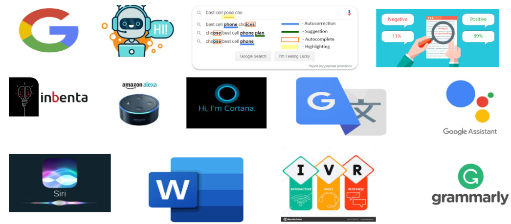

Bienvenue ! Voici ma synthèse de veille sur le traitement automatique du langage naturel (Natural language processing en anglais) NLP, réalisée dans le cadre du MOS 4.4 "Nouvelles Technologies de l’Information et de la Communication" à l’École Centrale de Lyon -*Salaheddine Mesdar*

## Introduction
Dans le cadre du MOS4.4 « Nouvelles technologies de l’Information et de la Communication » l’école Centrale de Lyon vise à former ses élèves ingénieurs à développer des techniques de recherche d’informations et d’en choisir les plus pertinentes vue le grand nombre d’informations publiées en Internet chaque jour. Les outils présentés dans ce MOS permettent de faire une bonne veille technologique concernant un sujet. Le sujet que j’ai choisi est le traitement du langage naturel ou Natural Language Processing (NLP) en anglais.

Le NLP est l'ensemble des techniques visant à modéliser et reproduire la capacité humaine à produire et à comprendre des énoncés linguistiques. Le NLP est un domaine de l'intelligence artificielle (IA) qui peut être définie comme une vaste branche de l'informatique qui s'intéresse à la construction de programmes informatiques intelligents pouvant effectuer des tâches qui requièrent généralement l'intelligence humaine. L'IA est une science interdisciplinaire aux approches multiples, mais le développement du Deep Learning (apprentissage profond) est en train de créer un changement de paradigme presque dans tous les secteurs de l'industrie technologique. 

L'intérêt d'une discipline comme le NLP réside dans la possibilité d'avoir de nouvelles informations grâce à l’explosion des données disponibles en ligne. Mais cette tâche est loin d'être facile vue que le NLP nécessite de grandes quantités de données, et celles-ci doivent être de bonne qualité et non biaisées en plus de la complexité des règles puisque certaines de ces règles peuvent être très abstraites. Par exemple, dans le cas d’utilisation d’une remarque sarcastique pour faire passer un message subtil, c'est très difficile pour une machine actuelle de percevoir de telles nuances.
## Historique 
L’histoire du NLP remonte aux années 1950, une époque caractérisée par l’apparition des premières méthodes de Deep Learning lorsqu’Alan Turing a publié un article intitulé "Computing Machinery and Intelligence" qui proposait ce que l'on appelle aujourd'hui le test de Turing comme critère d'intelligence, une tâche qui implique l'interprétation et la génération automatisées du langage naturel, mais qui, à l'époque, n'était pas formulée comme un problème distinct de l'intelligence artificielle. Dans un contexte de guerre froide, la compréhension des messages envoyé par les soviétiques était un défi pour l’armée et le gouvernement américains. Ils devaient traduire rapidement et d’une manière standardisée d’importants flux de textes écrits en russe. Cette tâche est non seulement chère et longue mais elle requiert normalement le travail de nombreux traducteurs. En effet, la conception et la réalisation d’un algorithme pouvant traduire rapidement était stratégique et budgétaire majeur, ce qui explique la création de la discipline et les recherches qui ont donné naissance aux premières découvertes dans le domaine du NLP.

- 1954 : La traduction entièrement automatique de plus de soixante phrases russes en anglais dans le cadre de l'expérience Georgetown.
- 1964 : Emergence des premiers chatbots comme ELIZA qui est une simulation d'une psychothérapeute rogérienne, reformulant sa réponse avec quelques règles de grammaire.
- 1978 : Création de LIFER/LADDER, une interface en langage naturel vers une base de données d'informations sur les navires de la marine américaine.
- 2006 : Création de Watson, un système de réponse aux questions qui a remporté le concours Jeopardy en battant les meilleurs joueurs humains en février 2011.
- 2011 : Création de l'assistant virtuel Siri développé par Apple.
- 2014 : Amazon l'assistant virtuel Alexa développé par Amazon.
- 2016 : Création de Google assistant.
- 2020 : A partir des données de pré-traitement, de grands modèles peuvent reproduire des faits et de répondre à des questions même sans accès à un contexte externe.

## Techniques du NLP : 
### Analyse lexicale : 
L'analyse lexicale est souvent le point d'entrée de nombreux pipelines de données NLP, elle repose sur la compréhension de la signification des mots, leur contexte et d’essayer d’obtenir la relation d'un mot avec d'autres. Ce type d'analyse peut prendre de nombreuses formes et variétés. Elle peut être utilisée comme la première étape du processus d'un compilateur en décomposant les lignes de code en une série de "tokens" d’un fichier de code source, et en supprimant tout espace blanc ou commentaire. Dans d'autres types d'application de cette analyse, elle peut conserver plusieurs mots ensemble sous la forme d'une séquence d'éléments (n-gramme). 
Après l’étape de tokenisation, l'ordinateur essaye d’extraire un sens en cherchant les mots dans un dictionnaire. Dans le cas d’un compilateur, il s'agira de trouver des mots-clés et d'en associer des opérations ou des variables. Alors que dans un contexte d'un robot de chat, par exemple, on essaye de voir à quoi correspondent des intentions d'une base de données. 
L’une des difficultés qui font face au NLP est qu’on peut trouver plusieurs sens pour un mot spécifique, ce qui signifie que la machine doit comprendre un mot dans son contexte. Cette tâche est souvent accomplie en associant chaque mot du dictionnaire au contexte du mot cible. Par exemple, le mot "terrain de baseball" peut être marqué dans l’ordinateur comme un lieu pour l'analyse syntaxique.
### Analyse syntaxique : 
Ce type d’analyse peut utiliser les résultats de l’analyse lexicale pour regrouper les mots d’une phrase. L'analyse syntaxique permet aussi d'extraire des phrases qui donnent plus de sens que les mots pris individuellement, comme dans un syntagme nominal par exemple. Elle peut être utilisée aussi pour améliorer l'indexation, puisqu’on peut utiliser les phrases comme des représentations de documents fournissant de meilleures informations que les index de mots isolés. Cependant, cette analyse peut être difficile à cause de la syntaxe qui peut être ambiguë, comme dans le cas de cette phrase : "Un garçon paralysé par une tumeur se bat pour devenir ceinture noire", qui explique comment un garçon a été paralysé à cause d'une tumeur, mais a enduré le combat contre la maladie et a finalement acquis un haut niveau de compétence en arts martiaux.

### Analyse sémantique :
L’analyse sémantique vise à mettre en relation les caractéristiques syntaxiques et désambiguïser les mots à définitions multiples dans le contexte donné pour déterminer le sens réel d’une phrase. Ce type d’analyse repose sur l'interprétation appropriée du sens des phrases, plutôt que sur l’analyse au niveau des mots ou des phrases pris individuellement. L’analyse sémantique permet aussi l'expansion des termes en utilisant des sources lexicales dans le cadre de la recherche d’informations. Cela permet de récupérer les documents pertinents même en absence des termes exacts dans la requête de recherche.
### Analyse pragmatique :
L’analyse pragmatique dans le NLP essaye d’utiliser des connaissances du monde réel et de voir leur impact sur le sens de ce qui est communiqué et elle permet d’avoir une représentation détaillée en analysant la dimension contextuelle des documents et des requêtes utilisées. Son application dans la recherche d’informations passe principalement par le traitement et la compréhension des requêtes utilisées en intégrant l'historique et les objectifs de l'utilisateur tout en respectant le contexte dans lequel la requête est effectuée. Les contextes peuvent inclure le temps et le lieu. Ce type d’analyse permet des avancées majeures en facilitant l’échange entre le système de recherche d’informations et l’utilisateur. En effet, il permet d’assurer que le système de recherche d'information est adapté à l'objectif pour lequel l'information recherchée est prévue d'être utilisée et d’obtenir cet objectif.

## Domaines d’application du NLP :
On l’ignore peut-être, mais de nombreuses applications qu’on utilise au quotidien reposent sur le traitement du langage naturel (NLP). On cite : 
- L’extraction d’information ou la recherche d’information (par exemple avec les moteurs de recherche Google, Inbenta etc.) 
- Création des chatbot de plus en plus « intelligents »
- Les assistants personnels tels que Apple Siri, Microsoft Cortana, Amazon Alexa ou Google assistant
- Analyse de sentiments : Cela peut par exemple permettre la surveillance des médias sociaux : Par exemple, détecter les tweets à sentiments négatifs pourrait permettre de réduire le harcèlement et le déferlement de violence se produisant sur Twitter. Ainsi l'analyse de sentiments peut être utilisée par exemple pour d’analyser la popularité d’un candidat politique et de prédire ainsi le vainqueur d’une élection présidentielle en se basent sur des tweets par exemple. Et cette analyse de sentiments peut par exemple permettre de suivre ce qui se dit à propos d’un produit ou service vendu par une entreprise et peut ainsi aider à détecter les clients en colère.
- Auto-correction orthographique et traduction
- Les traitements de texte comme Microsoft Word et Grammarly utilisent le NLP pour vérifier la grammaire et l’orthographe des textes. 
- Les applications de type Interactive Voice Response (IVR) utilisées par les centres d’appel permettent de traiter automatiquement certaines requêtes.

## Méthodes du NLP
### Phase de prétraitement de texte
Les données collectées sont souvent incohérentes, incomplètes et contenant généralement beaucoup de bruit est susceptibles d’avoir des erreurs. Par conséquent, comme dans les autres domaines de la science des données, la première étape est l’étape du nettoyage et la préparation du texte brute pour le transformer en un format compréhensible. On note text = "This IS an Introduction To NLP. Tell Me how do you find it? I Hope you found it amazing and interesting."
1.	Conversion des données textuelles en minuscules 
Cette étape vise à mettre toutes les données dans un format uniforme et de s'assurer que "NLP" et "nlp" sont traités de la même manière. Donc text devient: "this is an introduction to nlp. tell me how do you find it? i hope you found it amazing and interesting."
2.	Suppression de la ponctuation
Etant donné que la ponctuation n’apporte aucune information ou valeur supplémentaire dans ce contexte, la suppression de ces instances permet d’augmenter l’efficacité de calcul en réduisant la taille des données. Donc text devient: "this is an introduction to nlp tell me how do you find it i hope you found it amazing and interesting"
3.	Tokenisation du texte
Cette étape consiste à diviser le texte d’entrée en unités minimales significatives. Cette étape est une étape obligatoire du prétraitement du texte pour tout type d'analyse.
text devient: 
['this', 'is', 'an', 'introduction', 'to', 'nlp', 'tell', 'me', 'how', 'do', 'you', 'find', 'it', 'i', 'hope', 'you', 'found', 'it', 'amazing', 'and', 'interesting']
4.	Suppression des mots d'arrêt (Stop words)
Les mots d’arrêt (Exemple : à, en, comment, quel, auquel….) n’ont aucune signification ou une signification moindre par rapport aux autres mots-clés et leur suppression permettrait de se concentrer sur l’analyse de ces mots-clés. Donc text devient: ['introduction', 'nlp', 'tell', 'find', 'hope', 'found', 'amazing', 'interesting']
5.	Stemming
Le Stemming est un processus d'extraction de la racine d'un mot. Par exemple, "Poisson", "Poissons" sont transformés en "Poisson".
Exemple: The Boys’ cars are different colors => the boy car be differ color
text devient : ['introduct', 'nlp', 'tell', 'find', 'hope', 'found', 'amaz', 'interest']
6.	Lemmatisation
La lemmatisation consiste à extraire un mot racine en tenant compte du vocabulaire. Par exemple, "good", "better" ou "best" est lemmatisé en ’’good’’.  
Par exemple si on applique le stemming sur ’’ leafs’’ on aura ’’leaf’’ comme résultat et si on l’applique sur ’’leaves’’ on aura ’’leav’’, alors la lemmatisation permet d’avoir ’’leaf’’ dans les deux cas. Donc text devient: ""['introduct', 'nlp', 'tell', 'find', 'hope', 'find', 'amazing', 'interesting']

### Vectorisation du texte
Aprés le nettoyage et la préparation des données vient la partie de vectorisation des données. Cela signifie d'encoder l’ensemble de mots en un vecteur de nombres. Cela 
peut être dait par les méthodes N-gram, Bag of Words et Word Embeddings.
#### N-grams
La méthode N-grams prend en compte les voisinages des mots en considérant les mots précédents et suivants, pour voir si cela donne un sens correct et complet aux mots.
Par exemple, considérons le mot "pas mal". S'il est divisé en plusieurs mots, il ne pourra pas transmettre le mot "bon", qui est le sens réel de ce mot. Ce problème peut être résolu par N-grams.
Les N-grams sont la fusion de plusieurs lettres ou de plusieurs mots. Elles sont formés de telle manière que même les mots précédents et suivants sont capturés.
 - Les unigrammes sont les mots uniques présents dans la phrase.
- Le bigramme est la combinaison de 2 mots.
- Le trigramme est la combinaison de 3 mots et ainsi de suite.
Par exemple, pour la phrase "I am learning NLP":
- Unigrammes : “I”, “am”, “ learning”, “NLP”
- Bigrammes : “I am”, “am learning”, “learning NLP”
- Trigrammes : “I am learning”, “am learning NLP”
#### Bag of words
##### TF-IDF 
L'idée générale du TF-IDF est de refléter l'importance d'un mot pour un document dans une collection, et donc de normaliser les mots apparaissant fréquemment dans tous les documents.
- Fréquence des termes (TF) : La fréquence des termes est simplement le rapport entre le nombre de mots présents dans une phrase et la longueur de la phrase. La TF permet de saisir l'importance du mot indépendamment de la longueur du document. Par exemple, un mot dont la fréquence est de 3 pour une phrase de 10 mots n'a pas la même importance que pour une phrase de 100 mots. Il devrait avoir plus d'importance dans le premier scénario ; c'est ce que fait la TF.
- Fréquence inverse des documents (IDF) : L'IDF de chaque mot est le logarithme du le rapport entre le nombre total de lignes et le nombre de lignes d'un document particulier dans lequel ce mot est présent. document particulier dans lequel ce mot est présent. IDF = log(N/n), où N est le nombre total de lignes et n le nombre de lignes dans lesquelles le mot est présent. n est le nombre de lignes dans lesquelles le mot est présent. L'IDF mesure la rareté d'un terme. Des mots comme "a" et "the" apparaissent dans tous les documents du corpus. documents du corpus, mais les mots rares ne seront pas présents dans tous les documents. dans tous les documents. Donc, si un mot apparaît dans presque tous les documents, alors ce mot ne nous est d'aucune utilité puisqu'il ne nous aide pas à classer ou à recherche d'informations. L'IDF annulera ce problème.

TF-IDF est le simple produit de TF et IDF de sorte que les deux inconvénients sont traités, ce qui rend les prédictions et la recherche d'informations d'information.
##### Word Embeddings
Une diffculté que font face les deux méthodes citées ci-dessus est d'arriver à saisir le contexte et le sens des mots. Les deux méthodes discutées dépendent essentiellement de l'apparition ou de la fréquence des mots. Mais nous devons examiner comment saisir le contexte ou les relations sémantiques, c'est-à-dire la fréquence à laquelle les mots apparaissent à proximité les uns des autres.
- Je mange une pomme.
- J'utilise apple

 Dans l'exemple ci-dessus, Pomme donne des significations différentes lorsqu'il est utilisé avec différents mots adjacents (proches), manger et utiliser.
 Ainsi, dans le cas d'un problème tel que la classification de documents (classification de livres dans une bibliothèque), un document est vraiment très volumineux et un nombre énorme de tokens est généré. Dans ces scénarios, le nombre de caractéristiques peut devenir incontrôlable, ce qui nuit à la précision et aux performances.
 
 Les défis ci-dessus sont relevés par Word Embeddings. Word Embeddings est une technique d'apprentissage de caractéristiques où les mots du vocabulaire sont mis en correspondance avec des vecteurs de nombres réels capturant la hiérarchie contextuelle.
 
 Word Embeddings est basée sur la prédiction et utilisent des réseaux neuronaux peu profonds pour former le modèle qui conduira à l'apprentissage des poids et à leur utilisation comme représentation vectorielle.
 - word2vec : word2vec est une framework de Google basé sur l'apprentissage profond  pour former woord Embeddings. Il utilise tous les mots du corpus entier et prédit les mots proches. Il créera un vecteur pour tous les mots présents dans le corpus de manière à ce que le contexte soit capturé. Elle surpasse également toutes les autres méthodologies dans l'espace de similarité et d'analogie des mots.

Il y a principalement 2 types dans word2vec : 
- Skip-Gram
- Continuous Bag of Words (CBOW)
##### Skip-gram 
Le modèle skip-gram  est utilisé pour prédire les probabilités d'un mot étant donné le contexte du ou des mots. Prenons une petite phrase pour comprendre comment il fonctionne réellement. Chaque phrase va générer un mot cible et un contexte, qui sont les mots à proximité. Le nombre de mots à prendre en compte autour de la variable cible est appelé la taille de la fenêtre. La taille de la fenêtre doit être sélectionnée en fonction des données et des ressources dont on dispose. Plus la taille de la fenêtre est grande, plus la puissance de calcul est élevée.
##### Continuous Bag of Words (CBOW)
Dans le modèle CBOW, le contexte est représenté par plusieurs mots pour un mot cible donné. Par exemple, nous pourrions utiliser "chat" et "arbre" comme mots contextuels pour "grimpé" comme mot cible. Cela nécessite une modification de l'architecture du réseau neuronal utilisé au début. La modification consiste à répliquer C fois les connexions entre l'entrée et la couche cachée, soit le nombre de mots contextuels, et à ajouter une opération de division par C dans les neurones de la couche cachée.

### Conclusion
Le NLP est un domaine en amélioration continue tous les jours et connaît des avancées réguliéres. Grâce à l'amélioration de la précision, à la disponibilité multilingue et à un meilleur accès aux modèles pré-entraînés, le traitement automatique des langues devrait connaître une croissance encore plus importante cette année et l'année prochaine. Si les améliorations apportées à la technologie constituent une première étape importante, le succès des projets NLP dépend de la manière dont les entreprises préparent leurs activités et leurs équipes à la production. À mesure que ces projets passent de la phase de recherche aux applications du monde réel, les organisations qui adoptent une approche globale de l'adoption et du déploiement du NLP seront les futures gagnantes.
