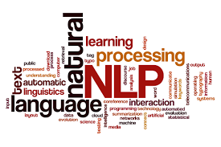

Bienvenue ! Voici ma synthèse de veille sur le traitement automatique du langage naturel (Natural language processing en anglais) NLP, réalisée dans le cadre du MOS 4.4 "Nouvelles Technologies de l’Information et de la Communication" à l’École Centrale de Lyon -*Salaheddine Mesdar*

## Introduction
Dans le cadre du MOS4.4 « Nouvelles technologies de l’Information et de la Communication » l’école Centrale de Lyon vise à former ses élèves ingénieurs à développer des techniques de recherche d’informations et d’en choisir les plus pertinentes vue le grand nombre d’informations publiées en Internet chaque jour. Les outils présentés dans ce MOS permettent de faire une bonne veille technologique concernant un sujet. Le sujet que j’ai choisi est le traitement du langage naturel ou Natural Language Processing (NLP) en anglais.

Le NLP est l'ensemble des techniques visant à modéliser et reproduire la capacité humaine à produire et à comprendre des énoncés linguistiques. Le NLP est un domaine de l'intelligence artificielle (IA) qui peut être définie comme une vaste branche de l'informatique qui s'intéresse à la construction de programmes informatiques intelligents pouvant effectuer des tâches qui requièrent généralement l'intelligence humaine. L'IA est une science interdisciplinaire aux approches multiples, mais le développement du Deep Learning (apprentissage profond) est en train de créer un changement de paradigme presque dans tous les secteurs de l'industrie technologique. 

L'intérêt d'une discipline comme le NLP réside dans la possibilité d'avoir de nouvelles informations grâce à l’explosion des données disponibles en ligne. Mais cette tâche est loin d'être facile vue que le NLP nécessite de grandes quantités de données, et celles-ci doivent être de bonne qualité et non biaisées en plus de la complexité des règles puisque certaines de ces règles peuvent être très abstraites. Par exemple, dans le cas d’utilisation d’une remarque sarcastique pour faire passer un message subtil, c'est très difficile pour une machine actuelle de percevoir de telles nuances.
## Historique 
L’histoire du NLP remonte aux années 1950, une époque caractérisée par l’apparition des premières méthodes de Deep Learning lorsqu’Alan Turing a publié un article intitulé "Computing Machinery and Intelligence" qui proposait ce que l'on appelle aujourd'hui le test de Turing comme critère d'intelligence, une tâche qui implique l'interprétation et la génération automatisées du langage naturel, mais qui, à l'époque, n'était pas formulée comme un problème distinct de l'intelligence artificielle. Dans un contexte de guerre froide, la compréhension des messages envoyé par les soviétiques était un défi pour l’armée et le gouvernement américains. Ils devaient traduire rapidement et d’une manière standardisée d’importants flux de textes écrits en russe. Cette tâche est non seulement chère et longue mais elle requiert normalement le travail de nombreux traducteurs. En effet, la conception et la réalisation d’un algorithme pouvant traduire rapidement était stratégique et budgétaire majeur, ce qui explique la création de la discipline et les recherches qui ont donné naissance aux premières découvertes dans le domaine du NLP.

- 1954 : La traduction entièrement automatique de plus de soixante phrases russes en anglais dans le cadre de l'expérience Georgetown.
- 1964 : Emergence des premiers chatbots comme ELIZA qui est une simulation d'une psychothérapeute rogérienne, reformulant sa réponse avec quelques règles de grammaire.
- 1978 : Création de LIFER/LADDER, une interface en langage naturel vers une base de données d'informations sur les navires de la marine américaine.
- 2006 : Création de Watson, un système de réponse aux questions qui a remporté le concours Jeopardy en battant les meilleurs joueurs humains en février 2011.
- 2011 : Création de l'assistant virtuel Siri développé par Apple.
- 2014 : Amazon l'assistant virtuel Alexa développé par Amazon.
- 2016 : Création de Google assistant.
- 2020 : A partir des données de pré-traitement, de grands modèles peuvent reproduire des faits et de répondre à des questions même sans accès à un contexte externe.

## Techniques du NLP : 
### Analyse lexicale : 
L'analyse lexicale est souvent le point d'entrée de nombreux pipelines de données NLP, elle repose sur la compréhension de la signification des mots, leur contexte et d’essayer d’obtenir la relation d'un mot avec d'autres. Ce type d'analyse peut prendre de nombreuses formes et variétés. Elle peut être utilisée comme la première étape du processus d'un compilateur en décomposant les lignes de code en une série de "tokens" d’un fichier de code source, et en supprimant tout espace blanc ou commentaire. Dans d'autres types d'application de cette analyse, elle peut conserver plusieurs mots ensemble sous la forme d'une séquence d'éléments (n-gramme). 
Après l’étape de tokenisation, l'ordinateur essaye d’extraire un sens en cherchant les mots dans un dictionnaire. Dans le cas d’un compilateur, il s'agira de trouver des mots-clés et d'en associer des opérations ou des variables. Alors que dans un contexte d'un robot de chat, par exemple, on essaye de voir à quoi correspondent des intentions d'une base de données. 
L’une des difficultés qui font face au NLP est qu’on peut trouver plusieurs sens pour un mot spécifique, ce qui signifie que la machine doit comprendre un mot dans son contexte. Cette tâche est souvent accomplie en associant chaque mot du dictionnaire au contexte du mot cible. Par exemple, le mot "terrain de baseball" peut être marqué dans l’ordinateur comme un lieu pour l'analyse syntaxique.
### Analyse syntaxique : 
Ce type d’analyse peut utiliser les résultats de l’analyse lexicale pour regrouper les mots d’une phrase. L'analyse syntaxique permet aussi d'extraire des phrases qui donnent plus de sens que les mots pris individuellement, comme dans un syntagme nominal par exemple. Elle peut être utilisée aussi pour améliorer l'indexation, puisqu’on peut utiliser les phrases comme des représentations de documents fournissant de meilleures informations que les index de mots isolés. Cependant, cette analyse peut être difficile à cause de la syntaxe qui peut être ambiguë, comme dans le cas de cette phrase : "Un garçon paralysé par une tumeur se bat pour devenir ceinture noire", qui explique comment un garçon a été paralysé à cause d'une tumeur, mais a enduré le combat contre la maladie et a finalement acquis un haut niveau de compétence en arts martiaux.

### Analyse sémantique :
L’analyse sémantique vise à mettre en relation les caractéristiques syntaxiques et désambiguïser les mots à définitions multiples dans le contexte donné pour déterminer le sens réel d’une phrase. Ce type d’analyse repose sur l'interprétation appropriée du sens des phrases, plutôt que sur l’analyse au niveau des mots ou des phrases pris individuellement. L’analyse sémantique permet aussi l'expansion des termes en utilisant des sources lexicales dans le cadre de la recherche d’informations. Cela permet de récupérer les documents pertinents même en absence des termes exacts dans la requête de recherche.
### Analyse pragmatique :
L’analyse pragmatique dans le NLP essaye d’utiliser des connaissances du monde réel et de voir leur impact sur le sens de ce qui est communiqué et elle permet d’avoir une représentation détaillée en analysant la dimension contextuelle des documents et des requêtes utilisées. Son application dans la recherche d’informations passe principalement par le traitement et la compréhension des requêtes utilisées en intégrant l'historique et les objectifs de l'utilisateur tout en respectant le contexte dans lequel la requête est effectuée. Les contextes peuvent inclure le temps et le lieu. Ce type d’analyse permet des avancées majeures en facilitant l’échange entre le système de recherche d’informations et l’utilisateur. En effet, il permet d’assurer que le système de recherche d'information est adapté à l'objectif pour lequel l'information recherchée est prévue d'être utilisée et d’obtenir cet objectif.

## Domaines d’application du NLP :
On l’ignore peut-être, mais de nombreuses applications qu’on utilise au quotidien reposent sur le traitement du langage naturel (NLP). On cite : 
- L’extraction d’information ou la recherche d’information (par exemple avec les moteurs de recherche Google, Inbenta etc.) 
- Création des chatbot de plus en plus « intelligents »
- Les assistants personnels tels que Apple Siri, Microsoft Cortana, Amazon Alexa ou Google assistant
- Analyse de sentiments : Cela peut par exemple permettre la surveillance des médias sociaux : Par exemple, détecter les tweets à sentiments négatifs pourrait permettre de réduire le harcèlement et le déferlement de violence se produisant sur Twitter. Ainsi l'analyse de sentiments peut être utilisée par exemple pour d’analyser la popularité d’un candidat politique et de prédire ainsi le vainqueur d’une élection présidentielle en se basent sur des tweets par exemple. Et cette analyse de sentiments peut par exemple permettre de suivre ce qui se dit à propos d’un produit ou service vendu par une entreprise et peut ainsi aider à détecter les clients en colère.
- Auto-correction orthographique et traduction
- Les traitements de texte comme Microsoft Word et Grammarly utilisent le NLP pour vérifier la grammaire et l’orthographe des textes. 
- Les applications de type Interactive Voice Response (IVR) utilisées par les centres d’appel permettent de traiter automatiquement certaines requêtes.

